# 🏛️ Omni Architecture — The Federation Governance Tricorder

> *"Passive Observation, Active Confirmation."*
>
> Omni sees everything. It changes nothing. It is the sensor array of the Federation — the All-Seeing Eye that maps reality so that others may act upon it.

This document is the canonical architectural reference for Omni. It describes the design philosophy, component topology, data flows, plugin systems, and key decisions that shape the tool.

---

## Table of Contents

1. [Design Philosophy](#-design-philosophy)
2. [The Trinity Architecture](#-the-trinity-architecture)
3. [Component Map](#-component-map)
4. [Scanner Plugin System](#-scanner-plugin-system)
5. [Pillar System](#-pillar-system)
6. [Configuration & Federation Heart](#-configuration--federation-heart)
7. [MCP Server Integration](#-mcp-server-integration)
8. [Data Flow](#-data-flow)
9. [Identity System](#-identity-system)
10. [Security Model](#-security-model)
11. [Design Patterns](#-design-patterns)
12. [Decision Log](#-decision-log)

---

## 🧭 Design Philosophy

Omni is built on five pillars of belief:

### 1. Passive Observation, Active Confirmation
Omni is a **read-only instrument**. Scanners observe and report; they never modify source files. The only components that write are Builders, and they write exclusively to designated artifact directories. This makes Omni safe to run on any codebase at any time — including production.

### 2. The Skeleton Key Pattern
Omni is a generic tool that unlocks specific enterprise capabilities **if present**, but works independently if not. The Federation Heart is an optional plugin; without it, Omni is still a fully functional scanner platform.

### 3. Plugin-First Design
Every scanner is a dynamically loaded plugin discovered at runtime via `SCANNER_MANIFEST.yaml` files. Adding a new scanner requires zero changes to the core — drop a file, register it in the manifest, and it exists.

### 4. Federation Instrument Pattern
Omni follows the [Federation Instrumentation Architecture](../../governance/protocols/docs/Federation_Instrumentation_Architecture.md) — a canonical pattern for all Federation tools:
- **Core** depends on nothing (pure logic)
- **Config** bridges to the Heart (single shim)
- **Scanners** depend on Core + Lib (never on Config directly)
- **Builders** depend on everything (the only write layer)

### 5. The Code Writes the Code
Omni's introspection tools generate documentation from reality. `omni introspect` reads the actual scanner registry, counts the actual files, and reports the actual drift. Documentation that disagrees with `introspect` is wrong — not the code.

---

## 🔱 The Trinity Architecture

Omni's architecture follows three distinct layers with strict dependency rules:

```mermaid
graph TB
    subgraph "Layer 3: Interface"
        CLI["⌨️ CLI (cli.py)<br/>14 commands"]
        MCP["🧠 MCP Server<br/>55 AI-callable tools"]
    end

    subgraph "Layer 2: Orchestration"
        CORE["🧠 Core<br/>Identity • Registry • Gate • Paths"]
        PILLARS["🏛️ Pillars<br/>Cartography • Intel<br/>Gatekeeper • Registry"]
        LIB["📚 Lib<br/>I/O • Render • Report<br/>Tree • TAP • Requirements"]
    end

    subgraph "Layer 1: Sensation"
        S_STATIC["📁 Static (9)"]
        S_ARCH["🏗️ Architecture (4)"]
        S_DISC["🔎 Discovery (8)"]
        S_POLY["🌐 Polyglot (4)"]
        S_LIB["📚 Library (6)"]
        S_GIT["🔀 Git (5)"]
        S_SEARCH["🔍 Search (3)"]
        S_DB["🗄️ DB (1)"]
        S_HEALTH["🛡️ Health (6)*"]
        S_DATABASE["🗃️ Database (5)*"]
        S_FLEET["⚓ Fleet (1)*"]
        S_PHOENIX["🔥 Phoenix (3)*"]
    end

    subgraph "Layer 0: Output"
        BUILDERS["🔧 Builders<br/>Registry Gen • Report Gen"]
    end

    CLI --> CORE
    CLI --> PILLARS
    MCP --> CORE
    PILLARS --> CORE
    PILLARS --> LIB
    CORE --> S_STATIC & S_ARCH & S_DISC & S_POLY & S_LIB & S_GIT & S_SEARCH & S_DB
    CORE --> S_HEALTH & S_DATABASE & S_FLEET & S_PHOENIX
    BUILDERS --> CORE
    BUILDERS --> LIB

    style S_HEALTH fill:#2d1b4e,stroke:#8b5cf6,color:#c4b5fd
    style S_DATABASE fill:#2d1b4e,stroke:#8b5cf6,color:#c4b5fd
    style S_FLEET fill:#2d1b4e,stroke:#8b5cf6,color:#c4b5fd
    style S_PHOENIX fill:#2d1b4e,stroke:#8b5cf6,color:#c4b5fd
```



> *Items marked with `*` are **Federation-exclusive** scanners — available when the Federation Heart is installed but not included in the open-source distribution.*

### Dependency Rules (Inviolable)
1. **Scanners** → may import from `omni.lib` and `omni.core.paths`. Nothing else.
2. **Pillars** → may import from `omni.core`, `omni.lib`, and `omni.scanners`.
3. **Core** → may import from `omni.config` and `omni.lib`. Never from Pillars or Scanners.
4. **CLI** → may import from anything. It is the outermost shell.
5. **Builders** → may import from anything. They are the write layer.

---

## 🗺️ Component Map

### `omni/cli.py` — The Bridge
The command-line entry point. A 1184-line dispatcher that parses arguments and routes to the appropriate subsystem. Every user interaction begins here.

**Commands**: `scan`, `inspect`, `gate`, `init`, `audit`, `canon`, `registry`, `library`, `introspect`, `interpret`, `map`, `tree`, `report`, `inspect-tree`

### `omni/core/` — The Brain

The kernel. Pure logic, zero side effects. Houses the modules that define Omni's understanding of the world:

| Module                | Codename         | Role                                                                                   |
| :-------------------- | :--------------- | :------------------------------------------------------------------------------------- |
| `identity_engine.py`  | The One Ring     | Canonical namespace (NAMESPACE_CMP), deterministic UUIDv5 minting, conflict resolution |
| `registry_builder.py` | The Cartographer | Constructs `PROJECT_REGISTRY_V1.yaml` from scan data                                   |
| `paths.py`            | The Navigator    | Federation-aware path resolution via CartographyPillar                                 |
| `gate.py`             | The Sentinel     | Policy enforcement logic for compliance gates                                          |
| `model.py`            | The Schema       | Data models for scan results                                                           |
| `config.py`           | The Bridge       | Lazy-loading shim to Federation Heart pillars                                          |

### `omni/config/` — The Federation Bridge

The single point of integration between Omni and the Federation Heart:

| Module                 | Role                                                                                                                                                                       |
| :--------------------- | :------------------------------------------------------------------------------------------------------------------------------------------------------------------------- |
| `settings.py`          | Configuration loading hierarchy (defaults → YAML → env → CLI). Federation Heart detection and proxy. **Note: This file is gitignored** — each deployment provides its own. |
| `settings_template.py` | Standalone fallback template shipped with open-source builds                                                                                                               |

### `omni/scanners/` — The Sensorium

55 scanners across 12 categories. Each scanner implements the universal contract:

```python
def scan(target: Path) -> dict:
    """Observe the target. Return structured findings. Modify nothing."""
```

Scanners are auto-discovered at runtime by the `__init__.py` registry loader, which walks each category directory and reads `SCANNER_MANIFEST.yaml` files.

See [Scanner Architecture Guide](omni/scanners/README.md) for the complete scanner reference.

### `omni/pillars/` — The Council Chamber

Four orchestration subsystems that coordinate scanners and produce higher-order intelligence:

| Pillar          | Role                      | Key Methods                                      |
| :-------------- | :------------------------ | :----------------------------------------------- |
| **Cartography** | Ecosystem mapping         | `map_ecosystem()`, dependency graph construction |
| **Intel**       | Multi-scanner aggregation | `gather_intelligence()`, pattern detection       |
| **Gatekeeper**  | Policy enforcement        | `validate_compliance()`, drift detection         |
| **Registry**    | Registry management       | `parse_registry()`, format validation            |

See [Pillars Architecture](omni/pillars/README.md) for the deep dive.

### `omni/lib/` — The Armory

Shared utilities used across all layers. These modules emphasize **error resilience** — lib functions never raise exceptions; they return `None` or `False` on failure.

| Module            | Purpose                                                     |
| :---------------- | :---------------------------------------------------------- |
| `io.py`           | Safe file I/O with UTF-8 encoding and directory creation    |
| `renderer.py`     | ASCII tables, tree rendering, colorization, markdown export |
| `reporting.py`    | Structured report generation from scan results              |
| `requirements.py` | Dependency file parsing and lock management                 |
| `tap.py`          | Crown Bus event utilities                                   |
| `tree.py`         | Directory tree generation and filtering                     |

See [Lib Documentation](omni/lib/README.md) for details.

### `omni/builders/` — The Forge

The only layer that writes. Builders take scan results and produce artifacts:

| Builder               | Output                     |
| :-------------------- | :------------------------- |
| `registry_builder.py` | `PROJECT_REGISTRY_V1.yaml` |
| Report generators     | Markdown and JSON reports  |

### `mcp_server/` — The Neural Link

An MCP (Model Context Protocol) server that wraps all 55 scanners as AI-callable tools. This allows any MCP-compatible AI assistant to invoke Omni programmatically.

See [MCP Server Documentation](mcp_server/README.md) for architecture.

---

## 🔍 Scanner Plugin System

### How Scanners Are Discovered


### The Scanner Contract

Every scanner MUST:
1. Live in a category subdirectory (e.g., `scanners/static/`)
2. Export a `scan(target: Path) -> dict` function
3. Be registered in the category's `SCANNER_MANIFEST.yaml`
4. **Never modify source files** (read-only guarantee)
5. **Never import from `omni.config`** (use `omni.core.paths` for path resolution)

### SCANNER_MANIFEST.yaml Format

```yaml
category: static
description: "Filesystem analysis scanners - no runtime dependencies"
scanners:
  - name: surfaces
    file: surfaces.py
    function: scan
    description: "Scans for contract surfaces (.contract.yaml)"
  - name: docs
    file: docs.py
    function: scan
    description: "Scans for documentation files"
```

### Scanner Output Standard

All scanners return a dict with at minimum:
```python
{
    "scanner": "scanner_name",
    "category": "category_name",
    "target": "/path/scanned",
    "timestamp": "2026-02-19T...",
    "count": 42,
    "items": [...]  # Scanner-specific findings
}
```

---

## 🏛️ Pillar System

Pillars sit between the CLI and the Scanners, providing **orchestration** — they combine multiple scanner outputs into higher-level intelligence.

### Pillar vs. Scanner vs. Lib

| Dimension          | Scanner          | Pillar                      | Lib               |
| :----------------- | :--------------- | :-------------------------- | :---------------- |
| **Scope**          | Single concern   | Multi-scanner orchestration | Utility functions |
| **Data**           | Raw observations | Synthesized intelligence    | N/A               |
| **State**          | Stateless        | May maintain state          | Stateless         |
| **Dependencies**   | Core + Lib only  | Core + Lib + Scanners       | Nothing           |
| **Error behavior** | May raise        | May raise                   | Never raises      |

### Pillar Architecture


---

## ⚙️ Configuration & Federation Heart

### The Skeleton Key

Omni uses a **single configuration shim** (`omni/config/settings.py`) to bridge between standalone and Federation operation:


### Configuration Hierarchy (Priority Order)

```
CLI flags         ← Highest priority
  ↑
Environment vars  (OMNI_ROOT, OMNI_WORKSPACES, etc.)
  ↑
omni.yml          (Project-level configuration)
  ↑
Built-in defaults ← Lowest priority
```

### Federation Heart Capabilities

When the Heart is available, `settings.py` proxies these services:

| Service                                       | Standalone Fallback            |
| :-------------------------------------------- | :----------------------------- |
| `CartographyPillar.get_infrastructure_root()` | `OMNI_ROOT` env var or cwd     |
| `CartographyPillar.resolve_path(domain)`      | Not available                  |
| `Constitution.load_constitution()`            | No policy enforcement          |
| CMP database connection                       | No project identity resolution |

---

## 🧠 MCP Server Integration

The MCP server (`mcp_server/omni_mcp_server.py`) wraps Omni's scanner registry and exposes each scanner as an MCP tool that AI assistants can call.

### Architecture


### Key Features
- **Dynamic Discovery**: The MCP server reads the same `SCANNER_MANIFEST.yaml` files as the CLI
- **Hot Reload**: Scanners can be reloaded without restarting the server
- **Introspection**: The `omni_introspect` tool reports all available scanners and drift
- **Dev Watcher**: `omni_dev_watcher.py` monitors scanner files for changes during development

---

## 🔄 Data Flow

### Scan Lifecycle


### Identity Resolution Flow

```mermaid
graph TD
    REPO["GitHub Repo Inventory"] --> IE["Identity Engine"]
    MASTER["Master Registry<br/>(Legacy UUIDs)"] --> IE
    CMP["CMP Database<br/>(Existing Records)"] --> IE

    IE --> KEY["Compute Canonical Key<br/>github:owner/repo"]
    KEY --> V5["Mint UUIDv5<br/>(deterministic)"]

    V5 --> CHECK{"UUID Conflict?"}
    CHECK -->|"DB ≠ Calculated"| FREEZE["🔴 CONFLICT_FREEZE<br/>Flag, don't fix"]
    CHECK -->|"DB = Calculated"| CONVERGE["🟢 CONVERGED<br/>Identity confirmed"]
    CHECK -->|"No DB record"| MINT["🟡 DISCOVERED<br/>New identity minted"]
```



---

## 🔐 Identity System

### The Canonical Namespace

```python
# WARNING: CHANGING THIS CONSTANT FORKS THE UNIVERSE.
NAMESPACE_CMP = uuid.UUID("c9c22e70-3882-4503-9db6-353d2629000b")
```

All project UUIDs in the Federation are deterministic UUIDv5s minted from this namespace and a canonical project key (`github:owner/repo`). This ensures:
- Same project → same UUID, always
- No central authority needed for minting
- Conflicts are detected, never silently resolved

### Policy C: Freeze & Adjudicate
When the Identity Engine detects a conflict (database UUID ≠ calculated UUID), it:
1. **Freezes** the existing database UUID (never overwrites)
2. **Flags** the conflict as `CONFLICT_FREEZE`
3. **Reports** both values for human adjudication

---

## 🛡️ Security Model

### Read-Only Guarantee
- Scanners **never** modify source files
- Scanners **never** execute discovered code
- The only write operations are to `artifacts/` directories

### Credential Safety
- `omni/config/settings.py` is gitignored — secrets never enter version control
- Scanners with `secret_exclusion: true` in their manifest automatically skip `.env`, `.secrets/`, and credential files
- Path resolution uses the Federation Heart when available, avoiding hardcoded paths

### UTF-8 Safety
All file I/O goes through `omni/lib/io.py`, which:
- Defaults to UTF-8 encoding
- Handles emoji and special characters gracefully
- Returns `None` on read failure rather than raising

---

## 🧩 Design Patterns

### 1. The Shim Pattern
Core modules never import the Federation Heart directly. Instead, they import from `omni.config.settings`, which acts as a shim:

```python
# ✅ Correct: Import through the shim
from omni.config import settings
root = settings.get_infrastructure_root()

# ❌ Wrong: Direct Heart import
from federation_heart.pillars.cartography import CartographyPillar
```

### 2. Lazy Loading
Pillars and settings are loaded only when first accessed, keeping startup fast:

```python
_cartography = None
_federation_available = False

try:
    from federation_heart.pillars.cartography import CartographyPillar
    _cartography = CartographyPillar()
    _federation_available = True
except ImportError:
    _federation_available = False
```

### 3. Error Resilience Tiers

| Layer        | Error Behavior                                            |
| :----------- | :-------------------------------------------------------- |
| **Lib**      | Never raises. Returns `None`, `False`, or empty defaults. |
| **Scanners** | May raise on invalid input. Caught by CLI.                |
| **Core**     | May raise on critical failures (identity conflicts).      |
| **CLI**      | Catches all exceptions. Prints human-readable errors.     |

### 4. Idempotent Operations
All write operations (Builders) are safe to run multiple times. Running `omni scan` twice produces the same artifacts — it overwrites cleanly, never appends or creates duplicates.

### 5. Breath Anchoring
Log output uses a "breath anchoring" pattern — phase breaks are buffered to avoid flooding the console during large scans. The system breathes between major phases, keeping output readable.

---

## 📝 Decision Log

| #    | Decision                                                          | Rationale                                                                                                   | Date     |
| :--- | :---------------------------------------------------------------- | :---------------------------------------------------------------------------------------------------------- | :------- |
| 1    | **Single config shim** instead of per-module Heart imports        | Reduces coupling, makes standalone mode trivial, prevents import spaghetti                                  | Dec 2025 |
| 2    | **SCANNER_MANIFEST.yaml** instead of decorator-based registration | Explicit > implicit. Manifests are readable, diffable, and don't require importing every scanner at startup | Dec 2025 |
| 3    | **Read-only scanners** as inviolable rule                         | Safety guarantee. Omni can be trusted to run anywhere without side effects                                  | Dec 2025 |
| 4    | **Pillars** as separate layer from Core                           | Core stays small and pure. Pillars handle the complexity of multi-scanner orchestration                     | Jan 2026 |
| 5    | **MCP server** wrapping scanner registry                          | AI-first integration. Any MCP-compatible assistant gets all 55 scanners for free                            | Feb 2026 |
| 6    | **Federation-exclusive scanners** gitignored but documented       | Transparent architecture. Users know what exists even if not distributed                                    | Feb 2026 |
| 7    | **Identity Engine** with Policy C (Freeze & Adjudicate)           | Never silently resolve UUID conflicts. Data integrity > convenience                                         | Feb 2026 |
| 8    | **Deterministic UUIDv5** over random UUID4                        | Reproducibility. Same project always gets same UUID across any system                                       | Feb 2026 |

---

## 📊 Metrics (Live from `omni introspect`)

| Metric             | Value |
| :----------------- | :---- |
| Scanner Categories | 12    |
| Total Scanners     | 55    |
| CLI Commands       | 14    |
| Manifest Files     | 12    |
| Core Modules       | 6     |
| Pillars            | 4     |
| Lib Modules        | 6+    |

---

<p align="center">
  <em>The Eye sees all. The Code writes the Code.</em><br/>
  <strong>Omni Architecture v0.7.0</strong>
</p>
