# Omni Architecture & Data Flow

## The Skeleton Key Pattern

Omni is designed as a **Skeleton Key** — a generic tool that unlocks specific enterprise capabilities if present, but works independently if not. The Federation Heart is the lock; Omni works with or without it.

### 1. The Entry Point (`cli.py`)
The user runs `omni scan`, `omni introspect`, or any of the 14 CLI verbs. `cli.py` parses arguments and dispatches to the appropriate subsystem.

### 2. Configuration (`settings.py`)
This is the **Bridge** — the single shim between Omni and the Federation Heart:
- **Heart Available**: Imports and proxies all calls to `CartographyPillar`, `Constitution`, and CMP
- **Heart Absent**: Falls back to `omni.yml`, environment variables, and built-in defaults
- **Crucially**: No hardcoded paths in core code. All path resolution goes through this bridge.

### 3. The Pillars (`omni/pillars/*.py`)
Smart shims that provide a consistent API regardless of federation state:
- **Cartography**: Maps ecosystems using `CartographyPillar` (or local config fallback)
- **Intel**: Aggregates multi-scanner data into intelligence reports
- **Gatekeeper**: Enforces compliance policies
- **Registry**: Manages `PROJECT_REGISTRY_V1.yaml`

### 4. The Scanners (`omni/scanners/`)
55 instruments across 12 categories, each auto-discovered via `SCANNER_MANIFEST.yaml`. Every scanner implements `scan(target: Path) → dict` and is guaranteed read-only.

### 5. The MCP Neural Link (`mcp_server/`)
Wraps the entire scanner registry as MCP tools, enabling any AI assistant to invoke Omni programmatically. Supports hot-reload during development.

### 6. The Federation Heart (Optional Plugin)
Contains proprietary business logic, sensitive paths, and CMP database access. **Open Source Strategy**: Release Omni (the skeleton). Users can build their own Heart or use standalone configuration.

## Directory Manifest

| Directory          | Purpose                                             | Status                  |
| :----------------- | :-------------------------------------------------- | :---------------------- |
| `omni/cli.py`      | CLI entry point — 14 commands                       | **OPEN**                |
| `omni/core/`       | Brain & conductor — identity, registry, gate, paths | **OPEN**                |
| `omni/config/`     | Federation Heart bridge — single shim               | **OPEN** (template)     |
| `omni/pillars/`    | Orchestration — adapts to Heart if present          | **OPEN**                |
| `omni/scanners/`   | 55 scanners across 12 categories                    | **OPEN** (8 categories) |
| `omni/lib/`        | Shared utilities — I/O, rendering, reporting        | **OPEN**                |
| `omni/builders/`   | Generators — registry, reports                      | **OPEN**                |
| `omni/scaffold/`   | Templates for new projects                          | **OPEN**                |
| `omni/templates/`  | Jinja2 report templates                             | **OPEN**                |
| `mcp_server/`      | MCP server — AI-callable scanner tools              | **OPEN**                |
| `federation_heart` | Enterprise plugin (separate package)                | **PRIVATE**             |

> Categories marked **OPEN** are included in the open-source build. Federation-exclusive scanner categories (`database/`, `fleet/`, `health/`, `phoenix/`) are documented but not distributed.

## Data Flow Diagram

```mermaid
graph TD
    User["👤 User / AI Agent"]-->CLI["⌨️ CLI (14 verbs)"]
    User-->MCP["🧠 MCP Server"]
    
    CLI-->Settings["⚙️ Settings Bridge"]
    MCP-->Registry["📋 Scanner Registry"]
    
    Settings-->Heart{"❤️ Heart<br/>Available?"}
    Heart-->|Yes|FedCore["🏛️ Federation Heart<br/>Cartography • Constitution • CMP"]
    Heart-->|No|LocalConfig["📄 Local Config<br/>omni.yml • env vars • defaults"]
    
    CLI-->Pillars["🏛️ Pillars<br/>Cartography • Intel<br/>Gatekeeper • Registry"]
    Pillars-->Settings
    Pillars-->Scanners["🔍 Scanners (55)"]
    
    Registry-->Scanners
    
    Scanners-->Results["📊 Scan Results"]
    Results-->Builders["🔧 Builders"]
    Builders-->Artifacts["📁 artifacts/"]
    
    style FedCore fill:#1a3a2a,stroke:#4ade80,color:#bbf7d0
    style LocalConfig fill:#1a2a3a,stroke:#60a5fa,color:#bfdbfe
```

