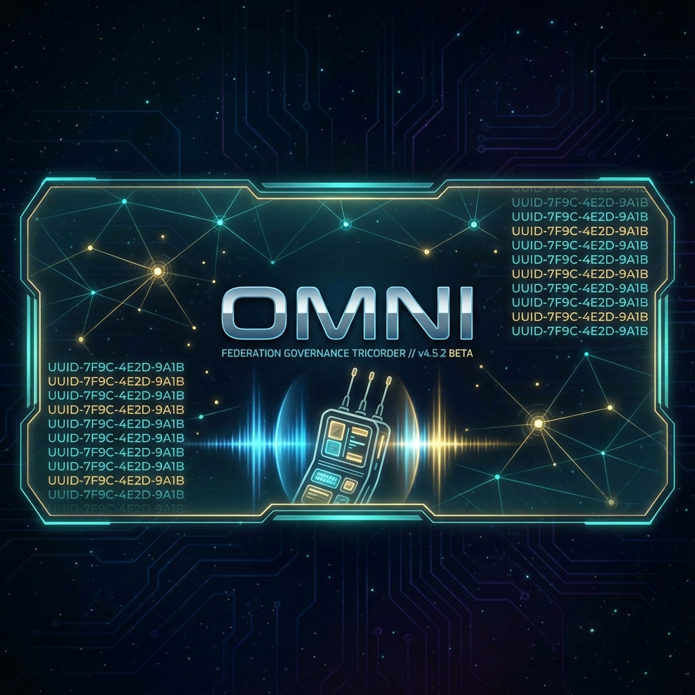

# 🔱 Omni — The All-Seeing Eye



**The Federation Governance Tricorder** — A modular, extensible observation engine that scans, maps, and guards codebases at galactic scale.

> *"Never trust documentation, trust reality."* — ACE

Omni is a Python-powered **passive observation platform** that discovers the truth about your code. It doesn't modify files or break builds — it sees, maps, and reports. Think of it as a **tricorder for your codebase**: point it at any directory and it reveals structure, dependencies, health, drift, and compliance in seconds.

---

## ✨ At a Glance

| Dimension                | Reading                                                               |
| :----------------------- | :-------------------------------------------------------------------- |
| 🔍 **Scanner Categories** | 12 (from static analysis to git archaeology)                          |
| 📦 **Total Scanners**     | 55 instruments across all categories                                  |
| ⚡ **CLI Commands**       | 14 verbs for every observation need                                   |
| 🧠 **MCP Server**         | Exposes all scanners as AI-callable tools                             |
| 🏛️ **Pillars**            | 4 orchestration subsystems (Cartography, Intel, Gatekeeper, Registry) |
| 🔌 **Federation Mode**    | Optional deep integration with a governance backend                   |
| 🦴 **Standalone Mode**    | Works anywhere — no backend required                                  |

---

## 🚀 Quick Start

> **New Here?** Check out the **[Beginner's Guide: Zero to Hero](docs/BEGINNERS_GUIDE.md)** for a step-by-step setup tutorial.

### Install
```bash
# From the omni directory
pip install -e .
```

### Your First Scan
```bash
# Scan the current directory with all static scanners
omni scan .

# Run a specific scanner
omni scan . --scanner surfaces

# See what Omni knows about itself
omni introspect
```

### Explore the Ecosystem
```bash
# Map your entire project constellation
omni map

# Check governance compliance
omni gate .

# Generate a full report
omni report . --format markdown
```

---

## 🏗️ Architecture — The Trinity

Omni follows the **Trinity Architecture** — three layers with strict separation of concerns:

```
                    ┌──────────────────────────┐
                    │        CLI (cli.py)       │  ← User interface
                    │     14 verbs, 1 brain     │
                    └────────────┬─────────────┘
                                 │
              ┌──────────────────┼──────────────────┐
              │                  │                  │
    ┌─────────▼──────┐  ┌───────▼────────┐  ┌──────▼───────┐
    │  🧠 CORE       │  │  🏛️ PILLARS    │  │  📚 LIB      │
    │  Identity      │  │  Cartography   │  │  I/O, Render │
    │  Registry      │  │  Intel         │  │  Reporting   │
    │  Gate          │  │  Gatekeeper    │  │  Tree, TAP   │
    │  Paths         │  │  Registry      │  │  Requirements│
    └─────────┬──────┘  └───────┬────────┘  └──────────────┘
              │                 │
    ┌─────────▼─────────────────▼──────────────────────────┐
    │              🔍 SCANNERS (55 Instruments)            │
    │   12 categories • Dynamic plugin loading             │
    │   Each scanner: scan(target: Path) → dict            │
    └──────────────────────────────────────────────────────┘
              │
    ┌─────────▼──────┐
    │  🔧 BUILDERS   │  ← The only layer that writes
    │  Registry Gen  │
    │  Report Gen    │
    └────────────────┘
```

> **Read-Only Guarantee**: Scanners never modify source files. Only Builders write, and only to designated artifact directories.

For the full architectural deep-dive, see **[ARCHITECTURE.md](ARCHITECTURE.md)**.

---

## 🔍 Scanner Categories

Omni's 55 scanners are organized into 12 categories. Each scanner implements the universal `scan(target: Path) → dict` contract and is auto-discovered via `SCANNER_MANIFEST.yaml` files.

### Open Source Scanners (Included in Build)

| Category                                          | Scanners | Purpose                                                                                     |
| :------------------------------------------------ | :------: | :------------------------------------------------------------------------------------------ |
| **📁 [static](omni/scanners/static/)**             |    9     | Filesystem analysis — contracts, deps, docs, events, hooks, imports, surfaces, tools, UUIDs |
| **🏗️ [architecture](omni/scanners/architecture/)** |    4     | Structural enforcement — import boundaries, coupling detection, drift analysis, compliance  |
| **🔎 [discovery](omni/scanners/discovery/)**       |    8     | Component cataloging — projects, CLI commands, cores, MCP servers, archives, census         |
| **🌐 [polyglot](omni/scanners/polyglot/)**         |    4     | Language ecosystems — Python packages, Node.js, Rust crates, generic (Go/Java/.NET/Docker)  |
| **📚 [library](omni/scanners/library/)**           |    6     | Document intelligence — cohesion analysis, content depth, knowledge graphs, rituals         |
| **🔀 [git](omni/scanners/git/)**                   |    5     | Repository intelligence — status, velocity, commit history, PR telemetry, utilities         |
| **🔍 [search](omni/scanners/search/)**             |    3     | Pattern matching — file search, text search, regex pattern search with context              |
| **🗄️ [db](omni/scanners/db/)**                     |    1     | Generic configuration-driven database scanning                                              |

### Federation-Exclusive Scanners (Not in Open Source Build)

> These scanners require the **Federation Heart** backend and are part of the proprietary governance layer. They appear in `omni introspect` when the Heart is available but are not distributed with the open-source release.

| Category       | Scanners | Purpose                                                                              |
| :------------- | :------: | :----------------------------------------------------------------------------------- |
| **🛡️ health**   |    6     | Runtime health — Federation, CMP, pillar, station, tunnel, and system status         |
| **🗃️ database** |    5     | CMP entity scanning — agents, artifacts, conversations, entities, projects           |
| **⚓ fleet**    |    1     | Fleet registry generation and validation                                             |
| **🔥 phoenix**  |    3     | Git history resurrection — archive scanning, orphan detection, temporal gap analysis |

Each category has its own README with detailed scanner documentation. See the [Scanner Architecture Guide](omni/scanners/README.md) for the complete reference.

---

## 🏛️ The Four Pillars

Pillars are orchestration subsystems that coordinate multiple scanners and produce higher-level intelligence:

| Pillar            | Role                  | Key Capability                                            |
| :---------------- | :-------------------- | :-------------------------------------------------------- |
| **🗺️ Cartography** | Ecosystem Mapper      | Maps project constellations and dependency webs           |
| **🕵️ Intel**       | Intelligence Gatherer | Aggregates multi-scanner data into actionable insights    |
| **⚖️ Gatekeeper**  | Policy Enforcer       | Validates compliance, catches drift, flags violations     |
| **📋 Registry**    | Registry Operator     | Parses, validates, and manages `PROJECT_REGISTRY_V1.yaml` |

See [Pillars Architecture](omni/pillars/README.md) for the deep dive.

---

## ⚡ CLI Command Reference

| Command             | Purpose                                                   |
| :------------------ | :-------------------------------------------------------- |
| `omni scan`         | Run scanners against a target directory                   |
| `omni inspect`      | Deep inspection of a single project                       |
| `omni gate`         | Policy enforcement and compliance checks                  |
| `omni map`          | Ecosystem cartography and dependency mapping              |
| `omni tree`         | Directory tree visualization                              |
| `omni audit`        | Provenance, dependency, and lock auditing                 |
| `omni registry`     | Registry operations and event scanning                    |
| `omni library`      | Grand Librarian document intelligence                     |
| `omni canon`        | Canon validation and discovery                            |
| `omni report`       | Generate structured reports                               |
| `omni init`         | Scaffold new Federation-compliant projects                |
| `omni introspect`   | Self-inspection — shows all scanners, drift, capabilities |
| `omni interpret`    | Interpret and explain scan results                        |
| `omni inspect-tree` | Combined tree + inspection                                |

---

## 🔌 Federation Mode vs. Standalone

Omni operates in two modes, transparently:

### Standalone Mode (Default)
No external dependencies. Configuration from `omni.yml` and environment variables. All open-source scanners work perfectly. Ideal for individual developers and open-source projects.

### Federation Mode (Optional)
When `federation_heart` is installed, Omni gains:
- **CartographyPillar** — Canonical path resolution across the entire Federation
- **Constitution** — Governance rule enforcement from a central authority
- **CMP Integration** — Project identity resolution against the Canonical Master Project database
- **Runtime Health** — Live status of Federation services, stations, and tunnels

The integration is handled by a **single shim** (`omni/config/settings.py`) that bridges to the Heart when available and falls back gracefully when it's not.

---

## 🧠 MCP Server

Omni includes a Model Context Protocol (MCP) server that exposes all 55 scanners as AI-callable tools. Any MCP-compatible AI assistant can invoke Omni's scanners programmatically.

```bash
# The MCP server auto-discovers all registered scanners
python -m mcp_server.omni_mcp_server
```

See [MCP Server Documentation](mcp_server/README.md) for setup and configuration.

---

## 📁 Project Structure

```
omni/
├── README.md              ← You are here
├── ARCHITECTURE.md        ← Full architectural deep-dive
├── CONTRIBUTING.md        ← How to add scanners and contribute
├── CHANGELOG.md           ← Version history
├── ROADMAP.md             ← Future plans
├── pyproject.toml         ← Package definition
├── omni/
│   ├── cli.py             ← CLI entry point (14 commands)
│   ├── core/              ← Brain — identity, registry, gate, paths
│   ├── config/            ← Configuration & Federation Heart bridge
│   ├── scanners/          ← 55 scanners across 12 categories
│   ├── pillars/           ← 4 orchestration subsystems
│   ├── lib/               ← Shared utilities (I/O, rendering, reporting)
│   ├── builders/          ← Registry and report generators
│   ├── scaffold/          ← Project templates
│   └── templates/         ← Jinja2 report templates
├── mcp_server/            ← MCP server exposing scanners as AI tools
├── scripts/               ← Operational scripts
├── tests/                 ← Test suite (pytest)
├── docs/                  ← Historical docs and plans
└── contracts/             ← Crown Contracts (C-TOOLS-OMNI-*)
```

---

## 🔧 Configuration

Omni follows a strict configuration hierarchy (highest priority wins):

1. **CLI flags** (e.g., `--scanner surfaces`)
2. **Environment variables** (e.g., `OMNI_ROOT`)
3. **`omni.yml`** (project-level configuration)
4. **Built-in defaults** (sensible fallbacks)

Key environment variables:
| Variable              | Purpose                           |
| :-------------------- | :-------------------------------- |
| `OMNI_ROOT`           | Override root path for scanning   |
| `OMNI_REPO_INVENTORY` | Path to repository inventory JSON |
| `OMNI_WORKSPACES`     | Workspace root paths              |
| `OMNI_DB_CONFIG_PATH` | Database configuration directory  |

See [Configuration Guide](omni/config/README.md) for full details.

---

## 🧪 Testing

```bash
# Run all tests
pytest tests/ -v

# With coverage
pytest tests/ --cov=omni --cov-report=html
```

See [Test Suite Documentation](tests/README.md) for fixtures, standards, and CI setup.

---

## 🤝 Contributing

We welcome new scanners, pillars, and improvements. The scanner plugin system makes it straightforward to add new observation capabilities:

1. Create a scanner file with a `scan(target: Path) → dict` function
2. Register it in the category's `SCANNER_MANIFEST.yaml`
3. Add tests and documentation

See **[CONTRIBUTING.md](CONTRIBUTING.md)** for the full guide.

---

## 📜 Requirements

- **Python**: 3.8+
- **Dependencies**: `pyyaml`, `pydantic` (core); `federation_heart` (optional, for Federation mode)
- **OS**: Windows, macOS, Linux

---

## 📋 License

Open source. See [LICENSE](LICENSE) for details.

---

<p align="center">
  <em>The All-Seeing Eye observes. The Code writes the Code.</em><br/>
  <strong>Omni v0.7.0</strong> — Pantheon LadderWorks
</p>
